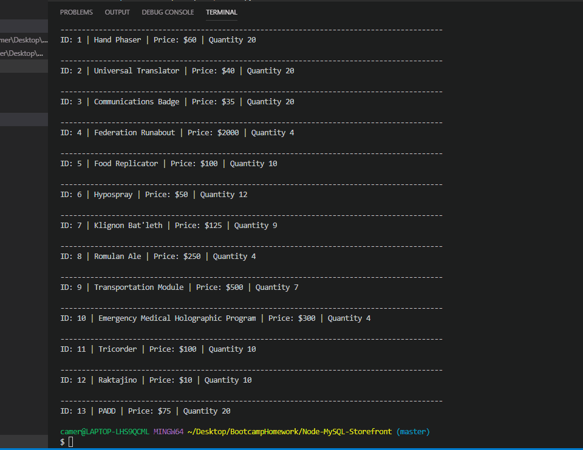
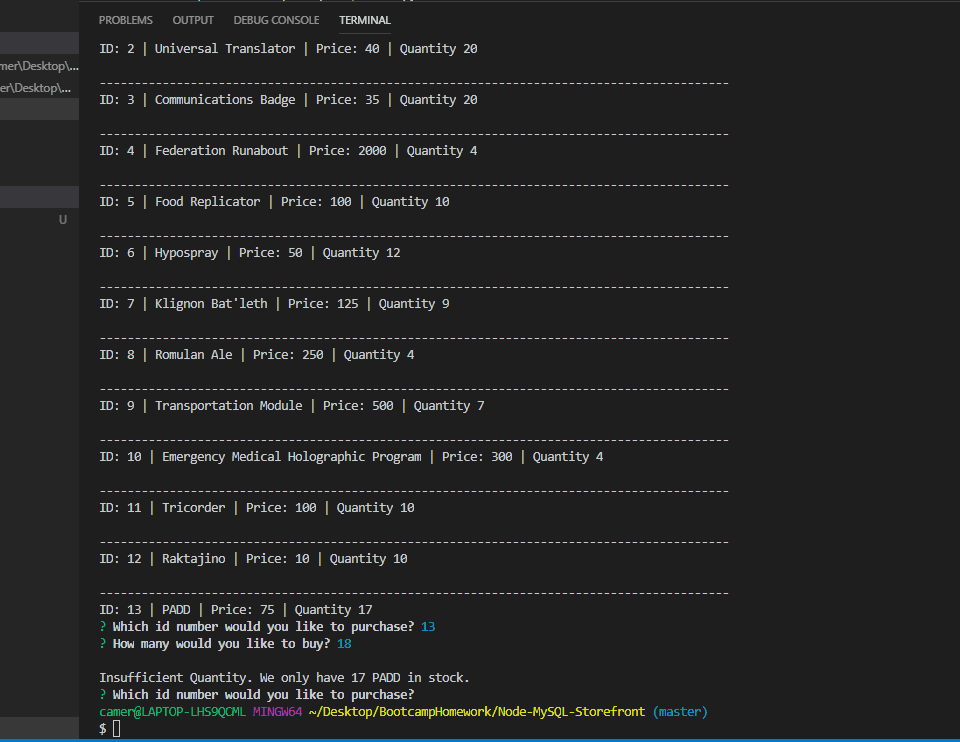
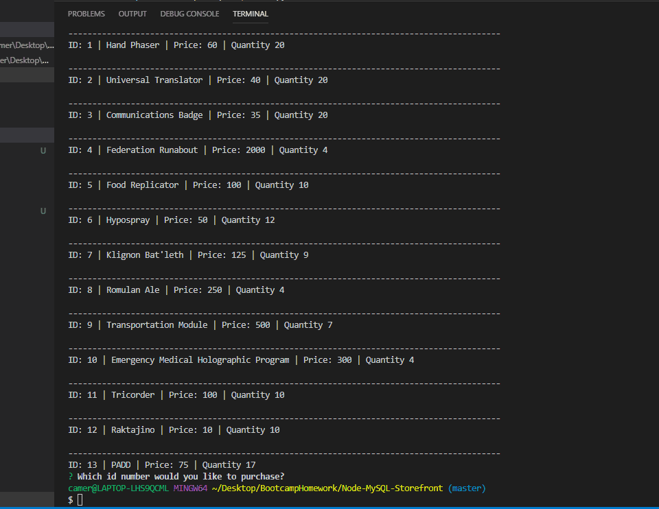
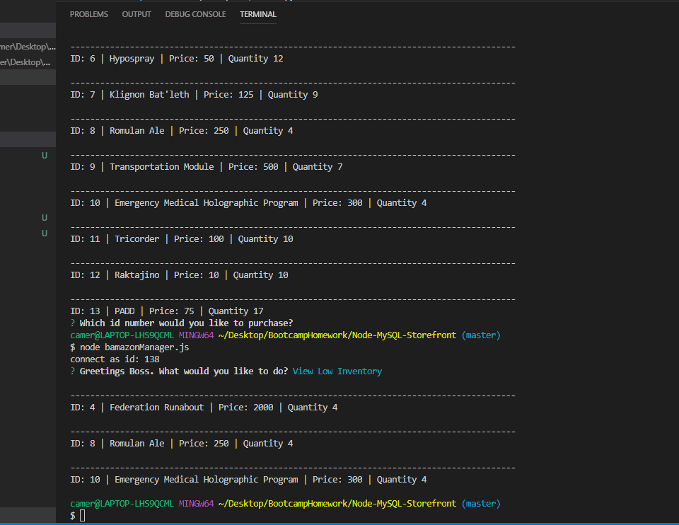
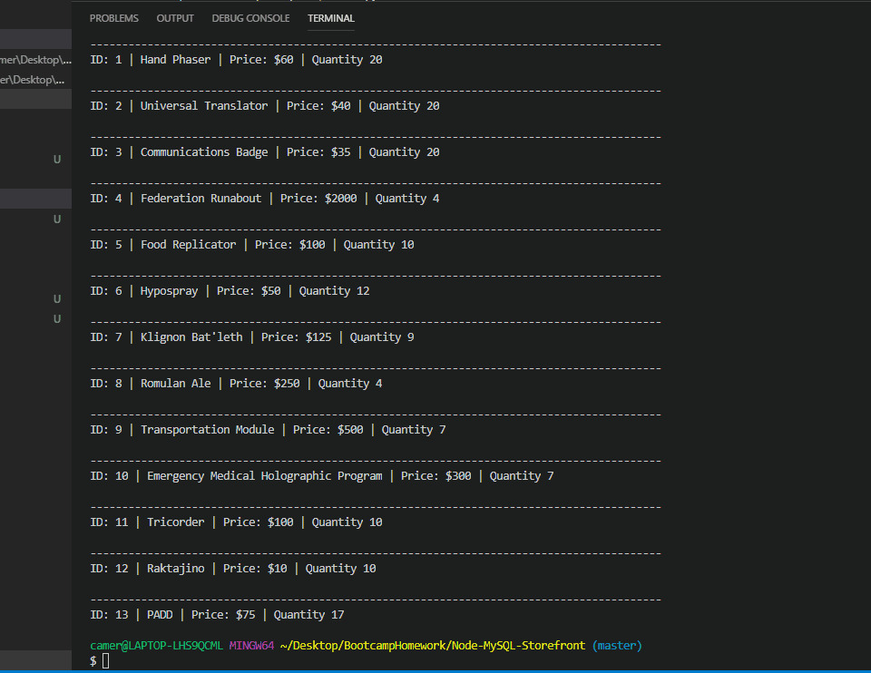

# Node-MySQL-Storefront
A command line based virtual store using Node and MySQL. There are two main apps with functionality.

**Customer View**
The customer view functionality will display to the user a list of all inventory in the store. The user will then pick which item they want to buy, and how many of that item. The program checks the database to make sure there is enough quantity. If there is enough stock, the purchase will go through and update the database's inventory accordingly. If there isn't enough stock the purchase will fail.

**Manager View**
The manager view will operate on four main functions:

**View Product Inventory**
Very similar to the beginning of customer view, will display inventory of all products to the page.

**View Low Inventory**
Will display all products that have a low inventory below 5 units.

**Add More Inventory**
Naturally after viewing which products have low inventory, we add to the inventory of a product of our choosing, adding as much quantity as we choose.

**Add New Product**
This function will allow us to create an entirely new product and add it into our inventory.

